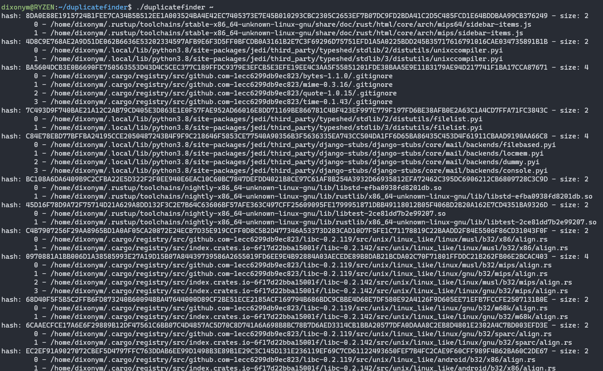

# duplicate finder

Simple duplicate finder using linked list and Blake2B as hash function in pure C. Blake2 implementation taken from [Blake2](https://github.com/BLAKE2/BLAKE2).

## Installation

```bash
git clone https://github.com/dix0nym/duplicatefinder
make
```

## Usage

```bash
./duplicatefinder [folder]
```

## Example


